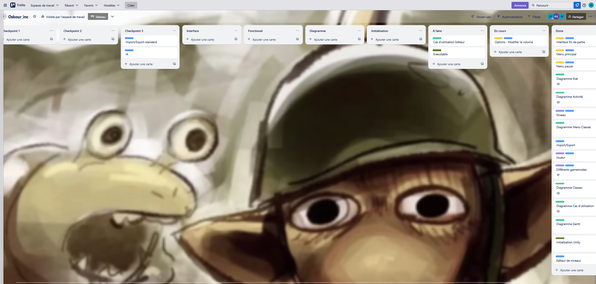
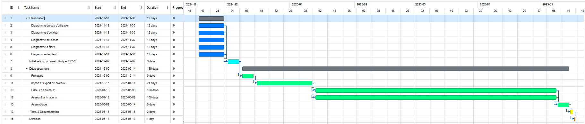

# OSKOUR.Inc

## Analyse UML
Sur ce git, vous pourrez trouver dans le dossier UML : 
- un diagramme de classes
- un diagramme d'états
- un diagramme d'activité
- une diagramme useCase
Pour chaque diagramme, un png et le fichier puml utilisé pour le générer sont présent.

## Contrôle de version
Sur ce projet, nous avons décidé d'utiliser Unity DevOps Version Control, qui est l'outil de gestion de version mis en place par Unity. Nous avons différentes branches : 
- la main, qui contient notre code stable,
puis les branches selon les différentes features : 
- level editor
- menu
- orbs portals
- player death
- gamemodes
- serialization
- assets

## Planification
La planification du projet a été faite et suivie par deux moyeux : Trello & un diagramme de Gantt

### Trello
[Accéder au Trello](https://trello.com/invite/b/67289e68c4fd9072247a1af7/ATTI92782fcaa240a02f5798cfb59cedae4b1D187122/geometry-dash-du-pauvre)

Le tableau est d'abord divisé en plusieurs tâches selon les différents checkpoints du cahier des charges. Puis recatégoriser en Interface ou Fonctionnel.
Dans un dernier temps, les tâches sont réparties dans les catégories A faire/En cours/Fait.

Nous avons instauré un code couleur pour plus facilement comprendre l'enjeu de chaque tâche : 
- Vert foncé : Diagrammes
- Vert clair : En lien avec la phase d'initialisation
- Bleu : Ce qui doit être coder
- Violet : Tout ce qui est fonctionnel
- Orange : Les interfaces

### Gantt

Le diagramme de Gantt est fichier .gantt, qui peut être ouvert sur ce [site](https://www.onlinegantt.com/#/gantt)

On dénombre 5 phases dans le projet : 
- La planification : la création des différents diagrammes
- L'initialisation : la création du projet Unity et la mise en place de UVCS
- Le développement : Phase la plus longue, avec la création d'un premier prototype, puis le développement des différents features. Elle se termine par l'assemblage de toutes ces features.
- Tests & Documentation : Différents tests faits sur le jeu & résolutions de derniers bugs
- Livraison

Chaque phase a sa couleur, de manière à rendre le diagramme plus lisible.

## Présentation du jeu

Oskour est un jeu inspiré de Geometry Dash, avec plusieurs modifications uniques. Dans ce jeu, vous incarnez un personnage en fuite, qui court automatiquement et doit esquiver une série d’obstacles dynamiques tout au long du parcours. L’objectif est de survivre jusqu’à la fin du niveau, en s’adaptant aux nombreux pièges et en tirant parti des bonus répartis sur le parcours.

Au fil du niveau, le joueur rencontre plusieurs types d’éléments interactifs :
- Des orbes de saut, permettant de réaliser un bond supplémentaire.
- Des portails d’inversion de gravité, qui retournent littéralement le gameplay en faisant courir le personnage au plafond.
- Des portails de transformation, qui placent le joueur aux commandes d’un vaisseau volant, changeant ainsi la mécanique de déplacement.

Le jeu prend en charge l’importation et l’exportation de niveaux personnalisés via des fichiers au format JSON. Ces fichiers contiennent toutes les informations nécessaires à la création d’un niveau : nom, position de départ du joueur, types et emplacements des obstacles et bonus.

Deux animations distinctes viennent enrichir l’expérience utilisateur :
- Une animation de mort, jouée lorsque le joueur échoue.
- Une animation de fin de niveau, lorsquee le joueur réussit le niveau.

L’interface utilisateur comprend :
- Un menu principal, pour accéder aux différentes fonctionnalités du jeu.
- Un menu de pause, depuis lequel il est possible de reprendre la partie ou de régler le volume du son.

Enfin, Oskour dispose d’un éditeur de niveaux intégré. Cet outil permet aux joueurs de concevoir leurs propres parcours en plaçant librement les obstacles, orbes, portails et autres éléments du jeu. Une fois créés, ces niveaux peuvent être joués, permettant au joueur de profiter de ses propres créations.

Projet réalisé par :
- Antoine GERMON :3
- Jules BELHOSTE
- Mina TOUAMA

